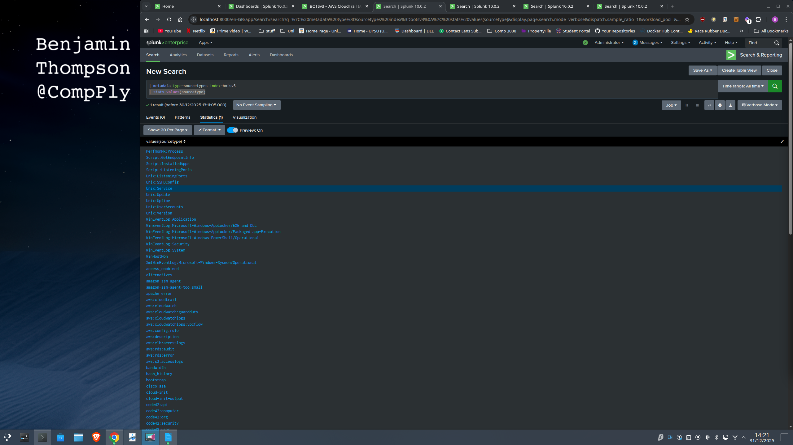
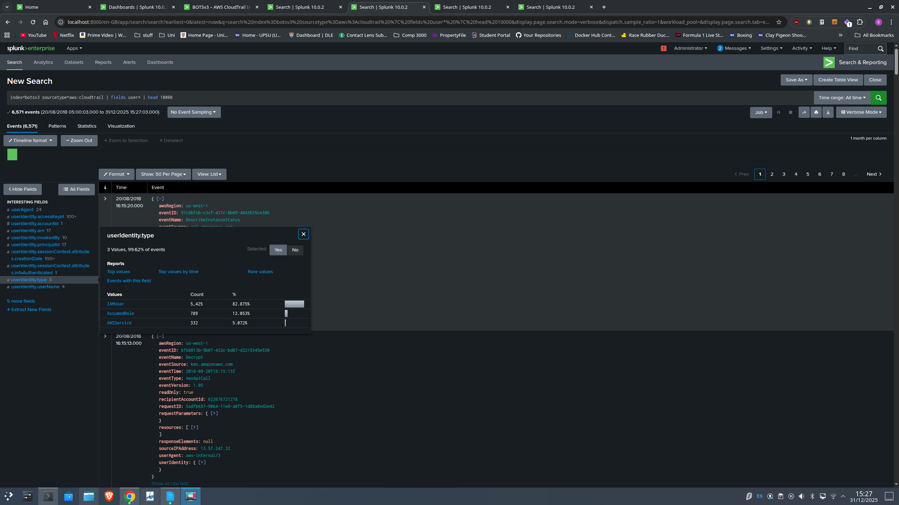
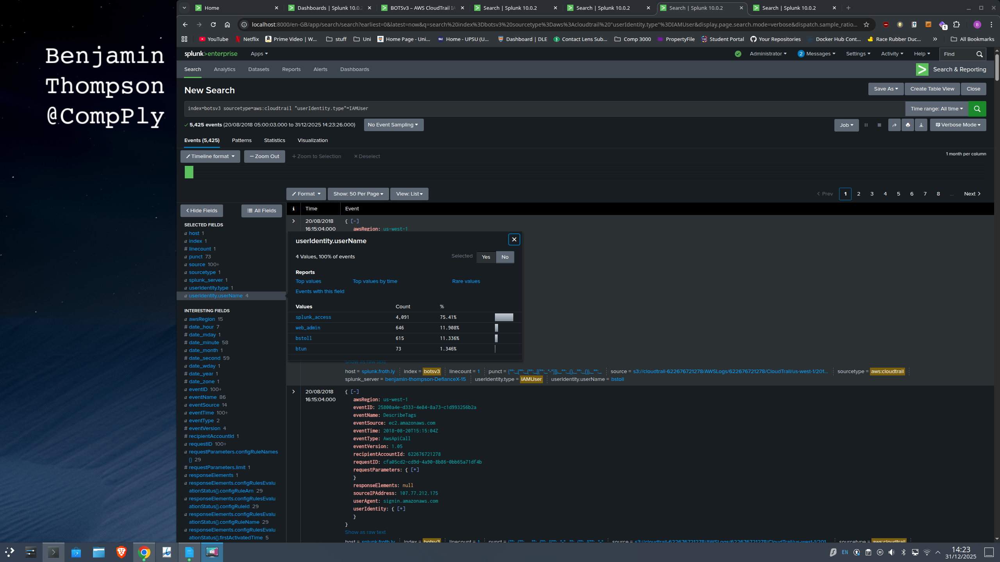
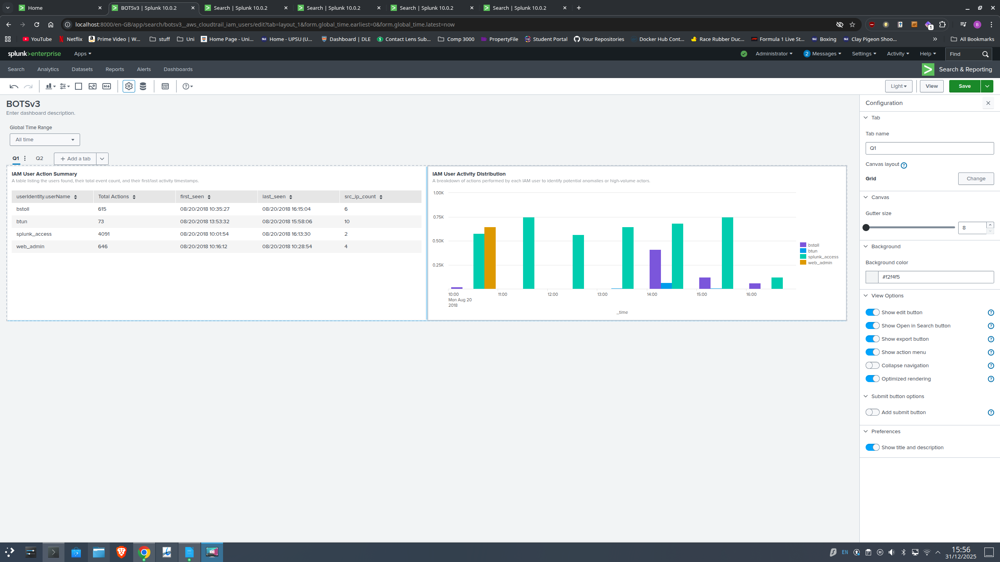
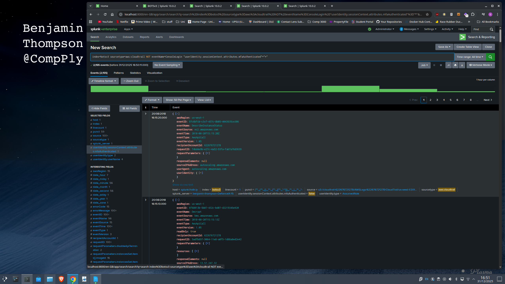
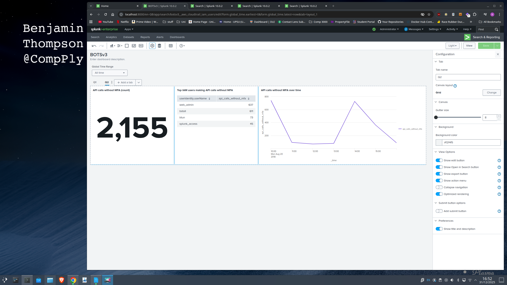
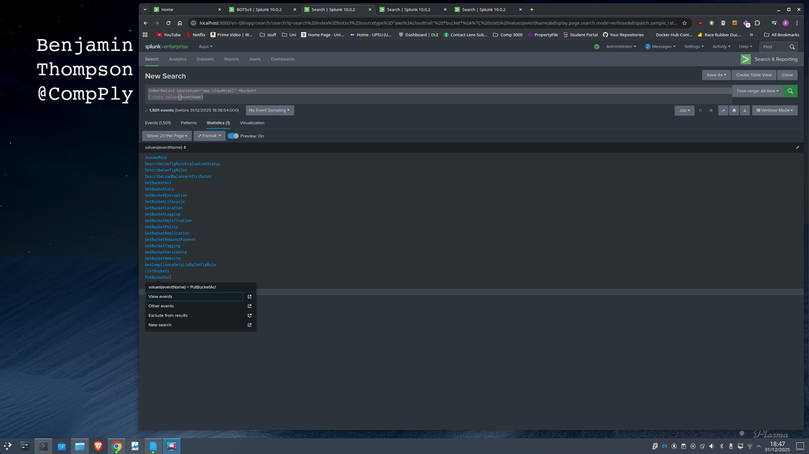
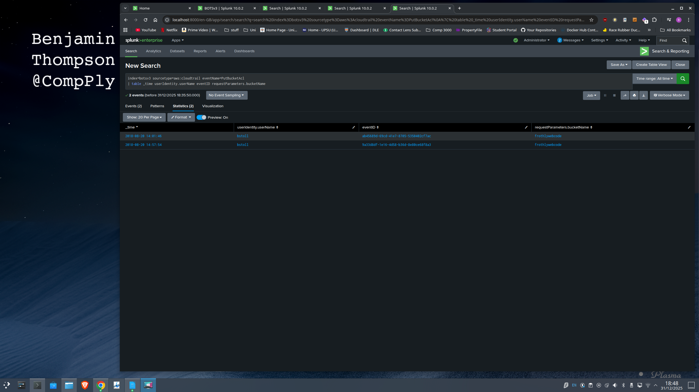
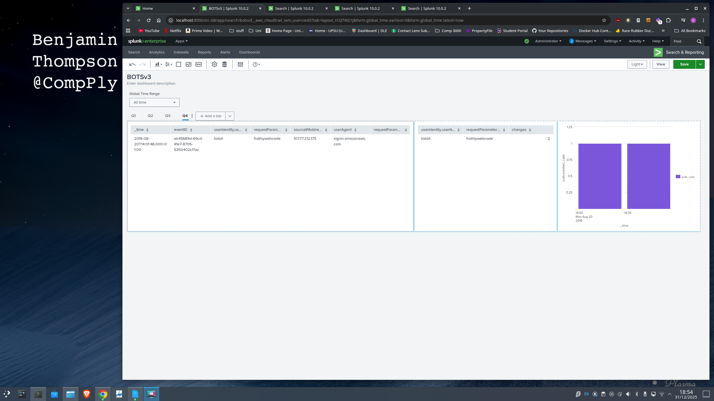
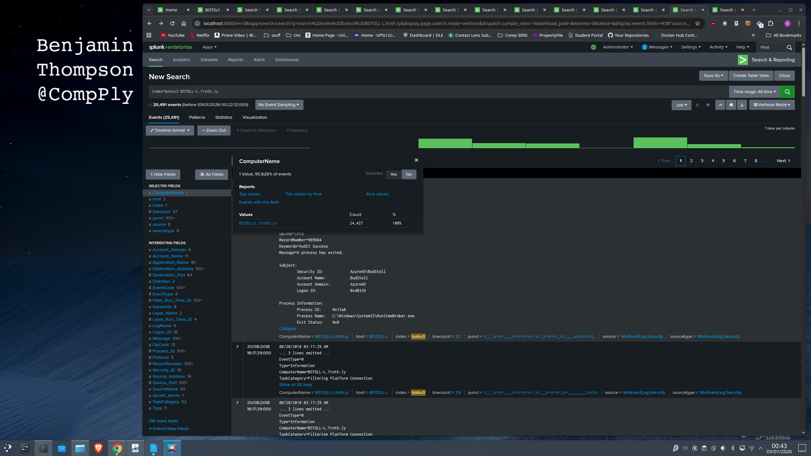

# BOTSv3 Incident Analysis Report (AWS 200-Level Q1–Q8)
**Project:** Frothly Corporation Incident Response  
**Author:** Benjamin Thompson (@CompPly)

---

## 1. Introduction
The Security Operations Centre (SOC) serves as the enterprise's central hub for monitoring, detecting, and responding to cyber threats (Vielberth et al., 2020). This report details a forensic investigation into a security incident at Frothly Corporation using the Boss of the SOC (BOTSv3) dataset. The scenario highlights the challenge of maintaining visibility across hybrid and cloud environments (Cloud Security Alliance, 2021).

The investigation leverages BOTSv3’s detailed telemetry to simulate real SOC conditions (Splunk, 2020). Unlike static data, the analyst must distinguish legitimate administrative actions from adversarial Tactics, Techniques, and Procedures (TTPs). This approach mirrors Tier 2 investigations, where interpretation and context are as crucial as raw log volume.

The goal is to demonstrate a defensible investigative workflow addressing the AWS-focused 200-level questions (Q1–Q8). Using Splunk Search Processing Language (SPL), the analysis identifies IAM principals, detects non-MFA API activity, and attributes S3 misconfigurations. Queries are designed for repeatability, with explicit indexes and sourcetypes, to maintain evidential integrity, enable peer review, and facilitate dashboard operationalisation for future audits. Findings follow the NIST incident response lifecycle to aid root cause analysis (Cichonski et al., 2012).

The scope includes only `botsv3` events, prioritising control-plane activity through `aws:cloudtrail`, data-plane confirmation via `aws:s3:accesslogs`, and endpoint inventory via `winhostmon`. Written from a Tier 2 Incident Responder perspective, recommendations adopt an “assumed breach” approach (SANS Institute, 2023).

---

## 2. SOC Roles & Incident Handling Reflection
For this investigation, a standard three-tier SOC model is assumed. The objective is to convert raw telemetry into defensible evidence, ensuring timely escalation while minimising "alert fatigue" (Vielberth et al., 2020).

The BOTSv3 dataset demonstrates that effective defence requires cross-functional competency (SANS Institute, 2023):

* **Tier 1 (Monitoring & Triage):** Validates high-volume signals (e.g., public S3 changes, non-MFA API spikes) and filters benign activity against approved change.
* **Tier 2 (Incident Response):** Correlates identity with data-plane impact, cross-checks endpoint logs for drift, and confirms scope and intent.
* **Tier 3 (Threat Hunting & Engineering):** Converts Tier 2 findings into durable detections, tuning logic to reduce noise and surface “Shadow IT”.

The workflow aligns with NIST SP 800-61 Rev. 2 (Cichonski et al., 2012):

* **Preparation:** Centralised CloudTrail and WinHostMon telemetry.
* **Detection & Analysis:** Validation, scoping, and TTP mapping (MITRE Corporation, 2025) to build confidence.
* **Containment:** Revoke keys and enforce S3 “Block Public Access”.
* **Eradication & Recovery:** Remove unauthorised objects and isolate non-compliant endpoints for reimaging.
* **Post-Incident:** Implement SCP guardrails to prevent recurrence.

Escalation from Tier 1 to Tier 2 occurs once unauthorised activity is confirmed (e.g., public access change plus upload evidence). The incident shows over-reliance on detection for high-risk cloud actions. Prevention is required: platform-level SCPs enforcing Multi-Factor Authentication (MFA) would reduce credential abuse at source, and shared accounts should be removed to restore non-repudiation. In cloud environments, identity is the perimeter; traditional network controls offer limited visibility into configuration changes (Cloud Security Alliance, 2021).

## 3. Installation & Data Preparation
Splunk Enterprise (v10.0.2) was installed on a Linux workstation in the `/opt/splunk` directory, following standard Linux conventions. This location isolates Splunk binaries and indexes from the root filesystem. The service was started using `$SPLUNK_HOME/bin/splunk start`. Although production SOCs use distributed architectures for scalability, a standalone design was chosen here for forensic isolation and data stability (Vielberth et al., 2020).


*Figure 1: Hostname 'DefianceX-15' and Splunk Version 10.0.2 validation.*

The BOTSv3 dataset was acquired from GitHub via the “botsv3” repository. The download was verified by checking the archive size, ensuring error-free extraction, and confirming the directory structure contained expected files before ingestion.


*Figure 2: Verifying the BOTSv3 dataset file structure.*

The process started by manually installing the `botsv3_data_set` app into `/opt/splunk/etc/apps/`, which included `props.conf` settings for CIM compliance, normalising raw JSON fields like `userIdentity` for cross-domain correlation. The dataset was then extracted locally and ingested through a monitored directory input to maintain a static, repeatable path separate from live network feeds.


*Figure 3: Configuring the monitored directory input.*

Data was sent to a dedicated `botsv3` index instead of the main index. This segmentation enforces Data Governance, supporting granular Retention Policies and Role-Based Access Control (RBAC) to protect sensitive data (ISACA, 2019). Post-ingestion, `tstats` validation confirmed **1,944,092 events**, establishing a baseline.


*Figure 4: Validating event count (1,944,092) in the botsv3 index.*

## 4.0 Analytical Methodology
To reconstruct the incident effectively, the investigation used a hypothesis-driven approach on the `botsv3` dataset (Lee and Bianco, 2016). A **"Funnel of Fidelity"** method managed alert volume: starting with broad searches across key sourcetypes (`aws:cloudtrail`, `winhostmon`) to establish a baseline, then filtering by high-fidelity indicators like specific Event IDs and User Agents to isolate the attack vector (Atkinson, 2019).


### 4.1 Question 1: Identification of IAM Users
Identify IAM users accessing AWS in Frothly. CloudTrail gives audit logs of control-plane activity. The investigation confirmed CloudTrail telemetry presence via metadata search. `(| metadata type=sourcetypes index=botsv3 | stats values(sourcetype))`.


*Figure 5: Confirming CloudTrail telemetry.*

Inspecting user-related fields within the `aws:cloudtrail` sourcetype confirmed that the field `userIdentity.type="IAMUser"` reliably distinguishes named IAM principals from other identity categories such as assumed roles.


*Figure 6: Inspecting user identity types.*

On this basis, the final aggregation query was executed:

```splunk
index=botsv3 sourcetype=aws:cloudtrail "userIdentity.type"=IAMUser
| stats count by userIdentity.userName
```

The results definitively identified four IAM users: bstoll, btun, splunk_access, and web_admin.

*Figure 7: Table of identified IAM users.*

These IAM users were also added to a dashboard so future actions can be monitored, as shown below.

*Figure 8: IAM Activity Dashboard.*

From a SOC perspective, an IAM identity baseline is vital for detection. Tier 1 analysts use it to flag anomalies, like a user connecting from many IPS. If unverified, they escalate to cloud admins to disable access keys. Sharing accounts like web_admin shows governance gaps. Security Engineering should replace generic logins with named accounts and enforce MFA to prevent this.

### 4.2 Question 2: Alerting on Non-MFA API Activity

The objective was to identify the CloudTrail field showing AWS API activity without MFA, excluding console logins. Since console and programmatic API authentications differ, the analysis was restricted to:

```splunk
index=botsv3 sourcetype=aws:cloudtrail NOT eventName=ConsoleLogin
```

*Figure 59: wtf i put here.*

Inspection of the event schema revealed the candidate field `userIdentity.sessionContext.attributes.mfaAuthenticated`. A comparative statistical analysis validated this field as the definitive indicator for API calls:

```splunk
index=botsv3 sourcetype=aws:cloudtrail NOT eventName=ConsoleLogin 
"userIdentity.sessionContext.attributes.mfaAuthenticated"="*"
```


*Figure 6: Inspecting user identity types.*

To operationalise this, a dashboard panel was built to summarise API calls by principal and 
MFA state, enabling quick verification that the field is consistently populated and 
differentiates MFA-authenticated and non-MFA sessions appropriately for SOC monitoring. 


*Figure 7: Table of identified IAM users.*

From a SOC perspective, non-MFA API activity indicates weak controls and potential 
credential misuse. Tier 1 can identify and report policy breaches, like the 2,155 API calls 
without MFA in this dataset. Tier 2 should verify if this behaviour is expected. Notably, the 
volume from web_admin and bstoll suggests privileged or shared access without a second 
factor. Long-term, security engineering should enforce MFA at the platform level- using, for 
example, an SCP with aws:MultiFactorAuthPresent- to prevent privileged API requests without 
MFA. 

## 4.3 Question 3: Web Server Processor Inventory

Identifying the processor number helps asset inventory, baseline validation, and asset tracking by defining hardware scope with index=botsv3 sourcetype="hardware", which returns host-level key–value attributes for system components, as shown in Figure 12. Inspection of CPU_TYPE revealed the processor consistently reported as Intel(R) Xeon(R) CPU E5-2676 v3 @ 2.40GHz, allowing us to identify the processor number as E5-2676.


Figure 12: Hardware inventory logs showing CPU type.

From a SOC perspective, accurate hardware inventory is crucial. Tier 1 and 2 analysts rely on this data to detect "Shadow IT" when physical hardware doesn't match the database, triggering immediate investigation. Tier 3 requires knowing exact processor models for vulnerability management, as threats like Spectre or Meltdown target specific CPU architectures. Without precise inventory, SOC analysts cannot identify which machines are exposed.

### 4.4 Question 4: S3 Bucket Public Access Identification

The investigation analysed aws:cloudtrail logs for control-plane modifications. An initial search for "bucket" identified PutBucketAcl as the API action used to modify permissions.

```splunk
index=botsv3 sourcetype=aws:cloudtrail eventName=PutBucketAcl
```

Figure 13: Identifying PutBucketAcl API actions.

A targeted filter was applied index=botsv3 sourcetype=aws:cloudtrail eventName=PutBucketAcl to isolate this field, which revealed 2 events in which the ACL was changed to nothing, allowing public access.


Figure 14: Events showing ACL changes allowing public access.

To further isolate this event, structuring the results into a time-sequenced table to correlate the action with a unique transaction identifier and a user identifier.

```splunk
index=botsv3 sourcetype=aws:cloudtrail eventName=PutBucketAcl
| table _time userIdentity.userName eventID requestParameters.bucketName
```

This analysis linked the event ID ab45689d-69cd-41e7-8705-5350402cf7ac to the user bstoll.


Figure 15: Correlating the event ID to user bstoll.

Operationalising this search logic into a permanent dashboard significantly enhances situational awareness by providing real-time visibility into critical configuration changes. In a SOC context, an unexpected PutBucketAcl event is a high-fidelity Indicator of Compromise (IoC). This dashboard allows Tier 2 analysts to rapidly triage alerts, verify Access Control List (ACL) parameters, and execute containment protocols like enforcing "S3 Block Public Access" before data exfiltration occurs. Transitioning from ad-hoc searching to continuous monitoring shows Tier 3 (Detection Engineering) maturity, shifting from reactive analysis to proactive infrastructure assurance.


Figure 16: Operational dashboard for critical configuration changes.

### 4.5 Question 5: Bud's Username

To identify the user responsible for the malicious S3 configuration change, the investigation examined the PutBucketAcl event (ab45689d-69cd-41e7-8705-5350402cf7ac) in CloudTrail. The logs confirmed the user was bstoll.

```splunk
index=botsv3 sourcetype=aws:cloudtrail eventID=ab45689d-69cd-41e7-8705-5350402cf7ac
| table _time eventName eventID userIdentity.userName userIdentity.arn
```

Figure 17: Confirming the user bstoll.

From a SOC perspective, anchoring identity to a specific, immutable event ID is essential for non-repudiation, allowing the incident response team to prove who approved the change. This aligns with risks in Q1 and Q2, where bstoll was flagged for API calls without MFA, forming a threat profile of a user bypassing authentication while modifying critical infrastructure. This warrants escalation to the "Insider Threat" playbook (CISA, 2020).

### 4.6 Question 6: The Bucket Name

The name of the S3 bucket that was made publicly accessible can be identified from the same CloudTrail event that enabled public access, ensuring the resource identification is directly linked to the misconfiguration (Figure 17). Reviewing the raw JSON payload for the PutBucketAcl event revealed that the bucketName parameter was populated with frothlywebcode.


Figure 18: JSON payload showing bucketName 'frothlywebcode'.

Identifying the affected bucket is key for scoping and response. The naming convention frothlywebcode increases severity, suggesting proprietary source code or assets. For Tier 2 analysts, this shifts the focus from a generic leak to possible IP theft, requiring correlation with aws:s3:accesslogs to check for unauthorised access.

### 4.7 Question 7: Data Exfiltration (File Upload)

After identifying the exposed bucket frothlywebcode, the investigation aimed to see if files were written during the exposure. CloudTrail shows changes like (PutBucketAcl) but doesn't confirm uploads. Switching to S3 access logs (sourcetype=aws:s3:accesslogs), which record request activity and outcomes, I filtered for successful uploads by selecting PUT requests with HTTP 200 responses for .txt files.

```splunk
index=botsv3 sourcetype="aws:s3:accesslogs" put .txt
```

The event indicates the uploaded object appears in the key field, labelled as OPEN_BUCKET_PLEASE_FIX.txt. The timestamp confirms this upload happened right after the ACL was modified.


Figure 19: Log confirming the upload of OPEN_BUCKET_PLEASE_FIX.txt.

SOC Relevance & Critical Reflection: Confirming a successful upload transforms this event from a passive vulnerability to an active breach. Operationally, any unknown file found in a public bucket must be treated as hostile. The immediate workflow requires Tier 2 analysts to isolate the object for sandbox analysis, checking for webshells or Command & Control (C2) configurations (SentinelOne, 2025). Remediation must include verifying the integrity of the bucket’s entire contents to ensure no legitimate assets were overwritten (Nelson et al., 2025).

### 4.8 Question 8: Endpoint Configuration Drift

To locate the endpoint running a different Windows edition, the search started by scoping out keywords to likely identify data sources for operating system inventory. The keywords used were Windows, operating system, OS, edition, Enterprise, Pro, hostname, FQDN, and using the hint winhostmon and then queried the endpoint monitoring sourcetype to review what host inventory data was available:

```splunk
index=botsv3 sourcetype=winhostmon
```


Figure 20: Initial search of winhostmon sourcetype.

Reviewing the returned events showed that the source field distinguishes different host inventory categories, including operatingsystem. I therefore refined the search to OS inventory records:

```splunk
index=botsv3 sourcetype=winhostmon source=operatingsystem
```

Figure 21: Refining search to source=operatingsystem.

These events record the Windows edition in the OS field and the endpoint identifier in host. To compare endpoints and isolate the outlier, I generated a de-duplicated host-to-edition table:

```splunk
index=botsv3 sourcetype=winhostmon
| dedup OS, host
| table OS, host
```

Figure 22: Host-to-edition table revealing the outlier.

Finally, to establish the endpoint, we use the host seen in Q7, which was host="splunk.froth.ly". Combining BSTOLL-L with .froth.ly gives us the answer BSTOLL-L.froth.ly.


Figure 23: Confirming the endpoint BSTOLL-L.froth.ly.

From a SOC perspective, a non-standard OS indicates Configuration Drift or Shadow IT, especially when a device deviates from the baseline, such as running "Pro" in an "Enterprise" environment, often without centralised management. Operational handling requires quick verification: Tier 2 analysts must check whether the device is a rogue "Bring-Your-Own-Device" (BYOD). If unmanaged, it should be isolated immediately. To prevent recurrence, organisations should implement Network Access Control (NAC), which verifies device health and OS version before granting network access (NIST, 2020).


## 5. Conclusion & Strategic Recommendations
This investigation shows a significant cloud security breach caused by identity and configuration governance flaws, not a new technical exploit. Analysis of AWS control-plane telemetry (CloudTrail) and endpoint data reveals that IAM principal (`bstoll`) changed S3 ACLs, creating public exposure for web asset buckets. S3 logs confirm Object access during the exposure, including an unauthorised object upload, demonstrating operational impact.

The issue was not a logging failure; events were captured accurately. The flaw was the lack of preventative controls to block risky actions. Additionally, a shared admin account and inconsistent endpoint setup reduce non-repudiation, complicating detection and response.

### Strategic Implications
Two lessons from this incident:
1.  **Identity controls are crucial in cloud environments.** Weak MFA and privilege management allow valid credentials to cause damage without perimeter controls.
2.  **Baseline discipline matters:** configuration drift, like different OS editions across devices, is a control gap until verified, as it suggests uneven security and monitoring.

### Recommendations
To move from reactive detection to resilient prevention, follow these priorities aligned with NIST SP 800-61 recovery and post-incident improvement:

* **Prevent public exposure** by enforcing S3 Block Public Access at the account level and restricting ACLs to avoid accidental exposure.
* **Enforce MFA with SCPs** to deny sensitive actions like `PutBucketAcl` when MFA isn't used.
* **Remove shared credentials** (`web_admin`), migrate to named accounts, and implement strict least privilege permissions.
* **Use automation like SOAR** to detect high-risk S3 permission changes, enabling quick rollback and alerts.
* **Implement baseline controls** such as Network Access Control and compliance reports to quarantine non-conforming endpoints until fixed.

---

## References
* Atkinson, J. (2019) *Introducing the Funnel of Fidelity*. Available at: https://posts.specterops.io/introducing-the-funnel-of-fidelity-b1bb59b04036
* Cichonski, P., Millar, T., Grance, T. and Scarfone, K. (2012) *Computer Security Incident Handling Guide*, NIST Special Publication 800-61 Revision 2. Gaithersburg: National Institute of Standards and Technology.
* CISA (2020) *Insider Threat Mitigation Guide*. Available at: https://www.cisa.gov/sites/default/files/2022-11/Insider%20Threat%20Mitigation%20Guide_Final_508.pdf
* Cloud Security Alliance (2021) *Top Threats to Cloud Computing: The Egregious 11*. Seattle: Cloud Security Alliance.
* ISACA (2019) *COBIT 2019 Framework: Governance and Management Objectives*. Schaumburg, IL: ISACA.
* Lee, R.M. and Bianco, D. (2016) *Generating Hypotheses for Successful Threat Hunting*. Bethesda: SANS Institute.
* MITRE Corporation (2025) *Valid Accounts, Technique T1078 - Enterprise | MITRE ATT&CK*. Available at: https://attack.mitre.org/techniques/T1078/
* Nelson, A., Rekhi, S., Souppaya, M. and Scarfone, K. (2025) *Incident Response Recommendations and Considerations for Cybersecurity Risk Management: A CSF 2.0 Community Profile*, NIST Special Publication 800-61 Revision 3. Gaithersburg: National Institute of Standards and Technology.
* NIST (2020) *Guidelines for Securing Wireless Local Area Networks (802.1X and NAC)*, SP 800-153. Gaithersburg: National Institute of Standards and Technology.
* SANS Institute (2023) *SOC Analyst Skills and Careers: A SANS Survey*. Bethesda: SANS Institute.
* SentinelOne (2025) *Amazon S3 Bucket Security - A Comprehensive Guide 101*. Available at: https://www.sentinelone.com/cybersecurity-101/cybersecurity/s3-bucket-security/
* Splunk (2020) *Boss of the SOC (BOTS) Version 3 Dataset*. Available at: https://github.com/splunk/botsv3
* Vielberth, M., Böhm, F., Fichtinger, I. and Pernul, G. (2020) 'Security Operations Center: A Systematic Study and Future Directions', *IEEE Access*, 8, pp. 227756-

